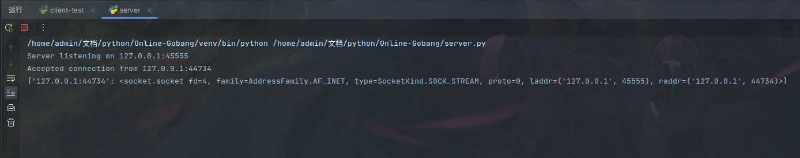

# LAN-Gobang

**五子棋联机**、**联机**、**局域网**

联机五子棋对战游戏，使用python编写。

## 演示效果

客户端首页


客户端在线列表


服务端


## 下载方式

克隆源码
```commandline
git clone https://github.com/keyblues/Online-Gobang.git
```
已打包完成的发行版
https://github.com/keyblues/Online-Gobang/releases

其中，源码版体积更小启动更快，但需要配置python环境，相对麻烦。
发行版使用pyinstaller打包，启动速度慢，胜在开箱即用。

## 游玩方法

对比局域网版本，online版分为server端和client端，其中server需要运行在独立的服务器上，源码版使用```python server.py```启动，打包版双击即可，
随后启动client端，玩家使用client端进行全部游戏，需要注意的是，启动server端不需要安装额外的python库，源码版client端需要使用
```pip install -r requirements.txt```来安装相应的包。

当然，我们提供了发行版，具体看上面的下载方式介绍

本游戏可跨平台对战，例如linux端可和windows端对战

## 博客

**https://www.keyblue.cn**
